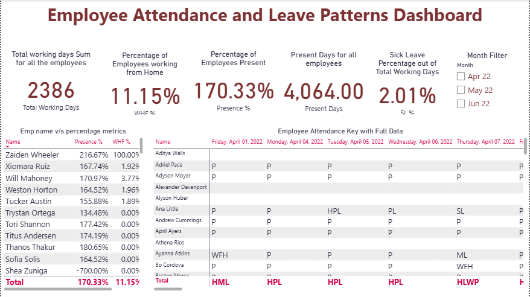
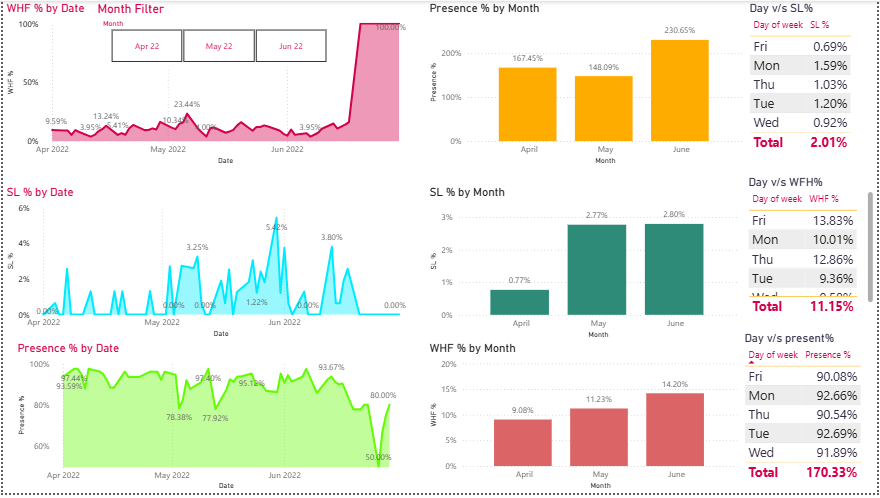

# Employee Attendance and Leave Patterns Dashboard using Power BI

## About the Project

This HR Analytics project analyzes employee attendance, work-from-home (WFH), and leave trends using Power BI. The dashboard converts raw attendance data into meaningful workforce insights, helping HR teams monitor employee availability, identify attendance patterns, and support data-driven decision-making.

## Project Description

1. Built an interactive HR Analytics dashboard to monitor employee attendance, WFH, and leave trends using Power BI.
2. Processed and analyzed 1,000+ employee attendance records to uncover workforce patterns and attendance behavior.
3. Cleaned, transformed, and standardized attendance data using Power Query for accurate reporting and analysis.
4. Developed DAX measures to calculate key HR metrics, including WFH (11.15%) and Sick Leave (2.01%) percentages.
5. Created dynamic visualizations and filters to analyze attendance and leave patterns by weekday and month.
6. Generated workforce insights to support attendance monitoring, resource planning, and HR decision-making.

## Tools Used

1. MS Excel
2. MySQL
3. Power BI
4. Power Query
5. DAX

## Key Metrics Tracked

1. Attendance Percentage
2. Work From Home (WFH) Percentage
3. Sick Leave (SL) Percentage
4. Presence by Day of Week
5. Attendance Trends by Month
6. Workforce Availability

## Key Insights

1. Identified an overall Work From Home (WFH) rate of 11.15%.
2. Analyzed Sick Leave (SL) utilization rate of 2.01%.
3. Tracked attendance, WFH, and leave patterns across weekdays and months.
4. Highlighted workforce availability trends to support HR planning and resource allocation.
5. Enabled quick monitoring of attendance metrics through interactive dashboard visualizations.

## Skills Demonstrated

1. HR Analytics
2. Data Cleaning and Transformation
3. Data Modeling
4. DAX Calculations
5. Power Query
6. Dashboard Development
7. Data Visualization
8. KPI Reporting
9. Workforce Analytics
10. Business Insight Generation

## Dashboard Screenshots

### Attendance & Leave Overview

### Attendance Trends & Insights

